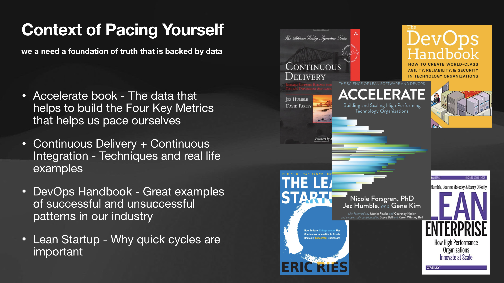

# Pace Yourself Session
## by Alfred Nutile

This will go with the https://nedcamp.org/sessions/2022/pacing-yourself-developer-freelance-or-employed

You can see a copy of it [here](https://www.icloud.com/keynote/040Mg4NuKGvAROZakHCKFIRsA#PacingYourself)

https://github.com/alnutile
https://alfrednutile.info
https://www.linkedin.com/in/alfrednutile/

## Some related links
* Twitter - https://twitter.com/alnutile
* CI/CD https://alfrednutile.info/posts/256
* Feature Flags https://alfrednutile.info/posts/84
* Facades - https://laravel.com/docs/9.x/facades#main-content
* Link to presentation https://bit.ly/pace-yourself-and-accelerate
* Code for this presentation https://github.com/alnutile/pace-your-self-lesson
* Article on CI/CD - How to easily get going with CI (https://alfrednutile.info/posts/256)
* Inertia - great way to build a UI with VueJS but not the complexity of SPA https://inertiajs.com
* Flow App - One of the many apps to help you pace yourself with Pomodoro https://flowapp.info
* YouTube Videos that I like to share - https://youtube.com/playlist?list=PLL8JVuiFkO9KNxX1VPT04-rAZqRI_G1j4
* Accelerate Article - Great overview of these topics and references to reading material https://alfrednutile.info/posts/261
* Timing App - I like how this just tracks all the apps I am working in so I can see my time per client eg "PHPStorm project Foo" https://timingapp.com
* Year/Monday/Day planning Template https://docs.google.com/spreadsheets/d/1q-2U7znHFJQe_GKg_Hscm3Nxci8uwSDeT2om-9wXRfo/edit?usp=sharing
* Continuous Delivery Book https://www.amazon.com/Continuous-Delivery-Deployment-Automation-Addison-Wesley/dp/0321601912
* Feature Flag Libraries https://github.com/ylsideas/feature-flags and https://github.com/friendsofcat/laravel-feature-flag (more features but hmm)
